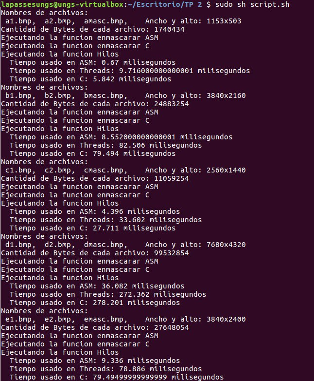
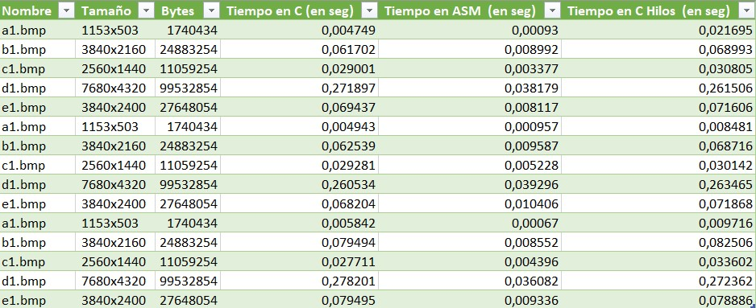
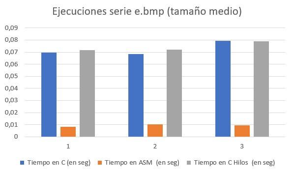
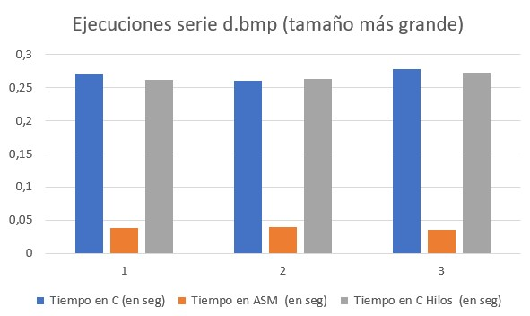

# TP2 - OC2 - SIMD | Threads

## Descripción

Para la materia Organización del Computador II ,se pidió un programa que procese imágenes por medio de la linea de comandos. El procesamiento consiste en tomar dos imágenes y una mascara de selección, la cual se aplica para combinar las dos imágenes pasadas.
El presente repositorio contiene el código assembler y C que realiza dicha operación.


## Prerrequisito
* Tener git instalado

## Instalación

* Traer el repositorio remoto a la pc a ejecutar el código:

```
git clone https://github.com/EmmanuelGuzman0112/tp2-orgacomp2/
```

## Resultados Obtenidos

Pasamos las siguientes dos imágenes y la mascara:

Imagen 1:


Imagen 2:


Máscara:


Finalmente el resultado es:


## Ejecución
* Para lograr lo anterior, ejecutar el script pasando las imágenes y la máscara:

```
sudo sh script.sh
```
Esto ejecutará un script que aplica la máscara a todas las imágenes:



## Métricas Obtenidas

Para las pruebas se ejecutaron tres corridas/ejecuciones del script anterior,obteniendo los siguientes resultados en el archivo .csv:



Con imágenes más livianas:


Con imágenes de tamaño medio



Con imágenes más pesadas:



## Conclusión

Concluimos que gracias a los registros MMX, podemos reducir bastante el tiempo de ejecución con respecto a ejecutarlo de forma secuencial e incluso con respecto a la ejecución en hilos. Al utilizar los registros implementados en MMX, estamos avanzando cada 8 bytes la imagen para su análisis. Esta es la explicación a los tiempos con respecto al secuencial, en el cual, como su nombre lo indica: recorremos byte por byte cada uno de ellos en la imagen.

Un comentario y no menor, los últimos bytes en la versión de assembler los recorremos con registros de propósito general. Esto sería de "forma secuencial" pero como comentamos arriba, solo son para los últimos 8 bytes.

Por otro lado, en la versión de hilos, implementamos 3 hilos , en los cada cual recorre solo su porción de imagen, es decir, partimos en 3 la cantidad bytes de la imagen y lanzamos los tres hilos en paralelo. En este caso no notamos mucha mejoría con respecto al secuencial ya que consideramos el tiempo de creación de hilo y su lanzamiento para cada uno, si bien se reducen los tiempos no es tan óptimo como MMX, ya que estamos usando solo 3 hilos.

## Integrantes del Equipo

* **Emmanuel Guzmán** - [EmmanuelGuzman0112](https://github.com/EmmanuelGuzman0112)
* **Christian Lopez**
* **Fabián Juárez** - [jfa320](https://github.com/jfa320)
